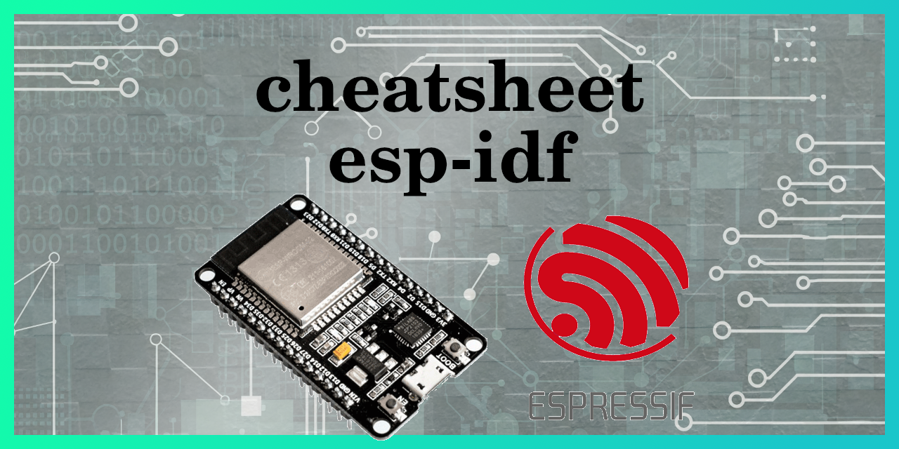

## INSTALACION Y SELECCION DE VERSION

Busca la release que quieras instalar y clonala en un directorio indicando la version, es posible que mas adelante necesites una version especifica para algun codigo concreto. Normalmente puedes encontrar esta info en las primeras lineas del archivo sdkconfig del proyecto

```
mkdir esp
cd esp
git clone --recursive https://github.com/espressif/esp-idf.git -b release/v5.3 esp-idf-5.3
```

Una vez tengas clonado el repositorio instalalo en tu equipo:
```
cd esp-idf-5.3
./install.sh
```

Cuando necesites que tu terminal use esp-idf con tu version especifica lanza export:
```
cd ~/esp/esp-idf-5.3/
. ./export.sh
```

Si necesitas otra version, lanza el export en el directorio de la version de idf adecuado.
```
idf.py --version
ESP-IDF v5.3.3-927-gbf79937908
```

## MODO MONITOR

Este modo reinicia el chip y muestra el debug. Para salir del modo monitor pulsa ctrl+]
```
idf.py -p /dev/ttyACM0 monitor
```

## MODO BUILD MONITOR
Este modo reinicia y carga el nuevo firmware. Para salir del modo monitor pulsa ctrl+]
```
idf.py -p /dev/ttyACM0 build monitor
```

## MODO BUILD FLASH MONITOR
Este modo reinicia, borra la memoria flash y carga el nuevo firmware. Para salir del modo monitor pulsa ctrl+]
```
idf.py -p /dev/ttyACM0 build monitor
```

